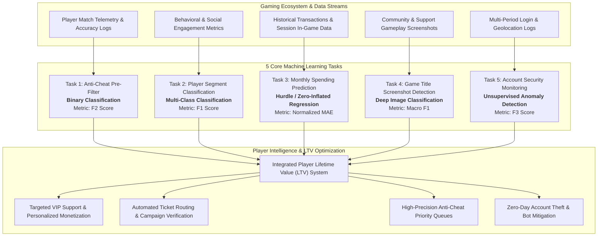

# CPE 342 Term Project: Karena Player Intelligence System

**Course:** CPE 342 Machine Learning (Semester 1/2024 / 2025–2026 Cohort)  
**Department:** Department of Computer Engineering, Faculty of Engineering, King Mongkut's University of Technology Thonburi (KMUTT)  
**Team Structure:** Group of 5 Machine Learning Engineers  
**Instructor & TAs:** Dr. Boonyarit Changaival, P’ Chokun (chotanansub.soph@kmutt.ac.th), P’ Noina (phanita.siri@kmutt.ac.th)

---

## 📖 Executive Summary & Industrial Background

**Karena Thailand** is a premier digital entertainment platform and game publisher operating across Southeast Asia (modeled after industry ecosystems such as *Garena*). The platform manages a diverse portfolio of flagship online titles across mobile, desktop, and multiplayer servers:
* **PUBE Mobile:** High-intensity tactical battle royale.
* **Free Fried:** Fast-paced competitive survival shooter.
* **7-11 Knights:** Fantasy character collection & tactical turn-based RPG.
* **Roblock:** User-generated sandbox multiplayer platform.
* **FiveN:** Roleplay & persistent community simulation.

### The Business Challenge
Operating at massive scale introduces critical operational and data challenges:
1. **Game Integrity Under Siege:** Over 10,000 daily cheat reports with manual review capacity capped at 500 cases/day. Subtle hacks (aimbot, wallhack) evade simple rule-based heuristics while innocent players suffer a 70% false positive rate, eroding competitive retention.
2. **Untargeted Marketing & Player Churn:** Generic promotional campaigns yield abysmal 2–5% conversion rates. Top 5% players (whales) generate 60% of total platform revenue, yet marketing messages fail to distinguish casual players, competitive grinders, social networkers, and big spenders.
3. **Financial Uncertainty & Revenue Forecasting:** Finance quarterly projections routinely deviate by 35–40% due to zero-inflated, highly skewed spending distributions. VIP customer support misallocates high-touch resources to low-value accounts while neglecting high-lifetime-value players.
4. **Customer Support Bottlenecks in Screenshot Routing:** 2,000 daily support tickets contain unlabelled gameplay screenshots. Support staff spend 10+ minutes per ticket manually deciphering which game is shown before routing to specialists.
5. **Account Takeover & Regional Exploits:** Over 5,000 monthly account theft incidents, bot farming networks, and VPN pricing arbitrage cost millions in revenue. Existing rule-based tripwires generate 60% false alarms on legitimate travelers while missing gradual anomaly patterns.

### The Engineering Mission
To resolve these bottlenecks, our team of ML engineers is tasked with building an end-to-end **AI-Powered Player Intelligence & Lifetime Value (LTV) System** comprising **5 interconnected machine learning models**.



---

## 🛠️ The 5 Core Machine Learning Tasks

| Task | Problem Description | ML Paradigm | Target Variable | Primary Metric | Data / Modality |
| :--- | :--- | :--- | :--- | :--- | :--- |
| **Task 1** | **Anti-Cheat Pre-Filter**<br/>Detect suspicious gameplay and high-probability aimbot/wallhack exploiters for priority manual review. | Binary Classification | `is_cheater`<br/>(0 = Legitimate, 1 = Cheater) | **$F_2$ Score**<br/>(Prioritizes Recall) | 33 features (32 predictors + label): `kill_death_ratio`, `headshot_percentage`, `reaction_time_ms`, etc. |
| **Task 2** | **Player Segment Classification**<br/>Classify player personas into 4 distinct behavioral segments for personalized marketing. | Multi-Class Classification | `segment`<br/>(0 = Casual, 1 = Grinder, 2 = Social, 3 = Whale) | **$F_1$ Score**<br/>(Macro/Micro Balance) | 45 features (44 predictors + label): `play_frequency`, `avg_session_duration`, `total_spending_thb`, etc. |
| **Task 3** | **Player Monthly Spending Prediction**<br/>Predict monetary in-game expenditure (THB) in the next 30 days. | Zero-Inflated Regression | `spending_30d`<br/>(Continuous, THB $\ge 0$) | **Normalized MAE**<br/>($\text{NMAE} = \frac{\text{MAE}}{\bar{y}}$) | 33 features (32 predictors + label): `historical_spending`, `friend_count`, `event_participation_rate`, etc. |
| **Task 4** | **Game Title Detection**<br/>Classify which Karena title is depicted in low-resolution gameplay screenshots. | Multi-Class Image Classification | `game_title`<br/>(`7-11K`, `fiveN`, `freefried`, `pube`, `roblock`) | **Macro $F_1$**<br/>(Equal class penalty) | Images centered-crop to $230 \times 120$ pixels (144p). Sourced from streams, player submissions, and UI states. |
| **Task 5** | **Account Security Monitoring**<br/>Flag abnormal account behavioral trajectories without ground-truth labels. | Unsupervised Anomaly Detection | `is_anomaly`<br/>(0 = Normal, 1 = Anomalous) | **$F_3$ Score**<br/>(Heavily penalizes False Negatives) | 33 features across 4 consecutive time periods (`_1`, `_2`, `_3`, `_4`): `login_count`, `login_lat`, `device_count`, etc. |

---

## 📐 Mathematical Formulation of Evaluation Metrics

### 1. General $F_\beta$ Measure (Tasks 1 & 5)
$$F_\beta = (1 + \beta^2) \frac{\text{Precision} \times \text{Recall}}{(\beta^2 \times \text{Precision}) + \text{Recall}} = \frac{(1 + \beta^2)\text{TP}}{(1 + \beta^2)\text{TP} + \beta^2 \text{FN} + \text{FP}}$$

* **Task 1 ($F_2$ Score, $\beta = 2$):** Recall is weighted **twice as important** as Precision. Catching real cheaters ($\text{FN} \to 0$) is prioritized over occasional false alarms passed to human verifiers.
  $$F_2 = 5 \cdot \frac{\text{Precision} \cdot \text{Recall}}{4\text{Precision} + \text{Recall}}$$
* **Task 5 ($F_3$ Score, $\beta = 3$):** Recall is weighted **three times as important** as Precision. Missing an account takeover or coordinated bot ring ($\text{FN}$) causes catastrophic economic loss, so high sensitivity is paramount.
  $$F_3 = 10 \cdot \frac{\text{Precision} \cdot \text{Recall}}{9\text{Precision} + \text{Recall}}$$

### 2. Macro $F_1$ Measure (Tasks 2 & 4)
For multi-class classification across $C$ classes ($C=4$ for Task 2, $C=5$ for Task 4):
$$F_{1, c} = 2 \cdot \frac{\text{Precision}_c \cdot \text{Recall}_c}{\text{Precision}_c + \text{Recall}_c}, \qquad \text{Macro } F_1 = \frac{1}{C}\sum_{c=1}^C F_{1, c}$$
Ensures performance is evaluated uniformly across rare segments (e.g. Whales) and low-sample screenshot classes.

### 3. Normalized Mean Absolute Error (Task 3)
$$\text{MAE} = \frac{1}{N}\sum_{i=1}^N |y_i - \hat{y}_i|, \qquad \text{NMAE} = \frac{\text{MAE}}{\bar{y}} = \frac{\sum_{i=1}^N |y_i - \hat{y}_i|}{\sum_{i=1}^N y_i}$$
Normalizes the absolute financial forecasting error relative to average baseline spending.

---

## 🏆 Kaggle Competition Submission Protocol

### Unified Submission Format
The final Kaggle submission requires a single consolidated file named `sample_submission.csv` containing **$25,889$ test rows** and **6 columns**:

```csv
id,task1,task2,task3,task4,task5
ANS00001,0,1,0.00,freefried,0
ANS00002,1,0,10500.50,fiveN,0
ANS00003,0,2,250.00,pube,1
...
ANS25889,0,3,78900.00,roblock,0
```

* `id`: String identifier ranging from `ANS00001` through `ANS25889`.
* `task1`: Integer binary indicator $\{0, 1\}$.
* `task2`: Integer class label $\{0, 1, 2, 3\}$.
* `task3`: Continuous float representing predicted 30-day spending in THB.
* `task4`: String game title: `7-11K`, `fiveN`, `freefried`, `pube`, or `roblock`.
* `task5`: Integer binary anomaly indicator $\{0, 1\}$.

### Grading Criteria & Score Conversion

```
Final Project Grade (100%)
├── 70%: Kaggle Competition Leaderboard Score
├── 20%: Academic Technical Report (Methodology, EDA, Error Analysis, Business Interpretation)
└── 10%: Git Repository Source Code & Reproduction Quality
```

#### Leaderboard Scoring Benchmarks:
* **Ground Baseline (Classroom Models):** Weighted Score (Public) = **$0.68$**  
  *Models: Logistic Regression, Random Forest, Vanilla CNN, Basic Isolation Forest.*
* **Challenge Baseline (Advanced Techniques):** Weighted Score (Public) = **$0.75$**  
  *Models: LightGBM / XGBoost / CatBoost Stacking, Hurdle Two-Stage Regression, Pretrained Transfer Learning (ViT / Swin / EfficientNet), Multi-model Voting Ensembles.*

#### T-Score Grade Conversion Formula:
$$\text{Grade \%} = \begin{cases} 
\alpha \cdot \left(\dfrac{\text{Your Score}}{\text{Baseline}}\right) & \text{if Score} < \text{Baseline} \\ 
\alpha + \left[(100\% - \alpha) \cdot \Phi(t)\right] & \text{if Score} \ge \text{Baseline} 
\end{cases}$$
where $\Phi(t)$ is the standard normal cumulative distribution function ($\mu, \sigma$ computed across groups above baseline), guaranteeing $\ge \alpha\%$ (typically $60\%$) for beating the baseline.

---

## 📜 Official Competition Rules

1. **Dataset Integrity:**
   * ✅ Use strictly the provided datasets for training and validation.
   * ✅ Training and validation sets may be merged for final production model training.
   * ❌ **Strict Prohibition:** Never use the test set for pseudo-labeling, transductive learning, or unsupervised pre-training.
2. **Model Training Guidelines:**
   * **Task 4 (Image Classification):** Pretrained weights and transfer learning architectures are **explicitly allowed** (e.g., MobileNetV2, ResNet, EfficientNet, Vision Transformers, Swin Transformers).
   * **Tasks 1, 2, 3, 5:** Must be trained **strictly from scratch**. Pretrained tabular representations are prohibited.
   * **AutoML Policy:** Commercial/black-box AutoML frameworks (e.g. AutoKeras, AutoGluon, TPOT) are strictly **prohibited**. Hyperparameter optimization libraries (e.g. Optuna, Hyperopt, Ray Tune) are **encouraged**.
3. **Collaboration & Academic Honesty:**
   * All work must be conducted exclusively within the registered 5-member team.
   * Conceptual discussions across teams are permitted; sharing code, features, or predictions is strictly forbidden.

---

## 📁 Repository Directory Architecture

```text
project/
├── CPE342_Project_Instruction.pdf         # Official project specification document
├── CPE342_Project_Instruction (Ver. 2025).pdf # Complete 40-page competition challenge slide deck
├── README.md                              # This authoritative technical specification guide
│
├── task1/                                 # Task 1: Anti-Cheat Pre-Filter (Binary Classification)
├── task2/                                 # Task 2: Player Segment Classification (Multi-Class)
├── task3/                                 # Task 3: Player Monthly Spending (Zero-Inflated Regression)
├── task4/                                 # Task 4: Game Title Screenshot Detection (Image Classification)
├── task5/                                 # Task 5: Account Security Monitoring (Unsupervised Anomaly Detection)
│
└── report/                                # Publication-Grade Academic Technical Report (XeLaTeX)
```

---

## 👥 Project Team Members

| Student ID | Full Name (Thai) | Full Name (English) | Role / Core Responsibilities |
| :---: | :--- | :--- | :--- |
| `67070501042` | นายวิศิษฐ์ สุวรรณเนาว์ | Wisit Suwannao | **Team Lead**, Pipeline Architecture, Technical Report & Benchmarking |
| `67070501003` | นายกันต์ธีร์ ดวงมณี | Guntee Doungmanee | ML Engineering, Feature Engineering & Validation |
| `67070501027` | นายนัธทวัฒน์ ปริมสิริคุณาวุฒิ | Natthawat Primsirikunawut | ML Engineering, Model Optimization & Diagnostics |
| `67070501045` | นายศุภวิชญ์ มารยาท | Supawit Marayat | Data Preprocessing, Ensembling & Hyperparameter Search |
| `67070501067` | นายพลวริษฐ์ วัฒนเหมรัตน์ | Polwarit Watthanahemmarat | Deep Learning Architectures & Anomaly Detection Pipelines |

---

## 🔗 Official Registration & Competition Setup

1. **Step 1: Team Registration (KMUTT Excel):**
   * Register your 5-member team on the [KMUTT Team Registration Sheet](https://mailkmuttacth-my.sharepoint.com/:x:/g/personal/papit_vieng_kmutt_ac_th/IQBIaRtyJYJjSYWtXEWlJHD2AXW2ozmqp-ezObm8h420ibo?e=UHRoIh)
   * This entry generates your official **Team ID** (e.g. `ML001`). Use this Team ID consistently across all reports and submissions.
2. **Step 2: Join the Kaggle Competition:**
   * Log in to Kaggle and join via the official competition link: [Kaggle Competition Invitation](https://www.kaggle.com/t/3028c241ac9244d0bf0e95e165c858fd)
3. **Step 3: Kaggle Team Setup:**
   * Name your Kaggle team **exactly as your official Team ID** (e.g. `ML001`).
   * Invite all 5 teammates into the Kaggle team.

---

## 📅 Milestones & Deadlines (Official Timeline)

* **Kaggle Opens:** November 2, 2026 (Dataset release & leaderboard opens)
* **Kaggle Closes:** November 24, 2026 (Final leaderboard freeze)
* **Technical Report & Source Code Due Date:** November 30, 2026 (Submission via LEB2)
